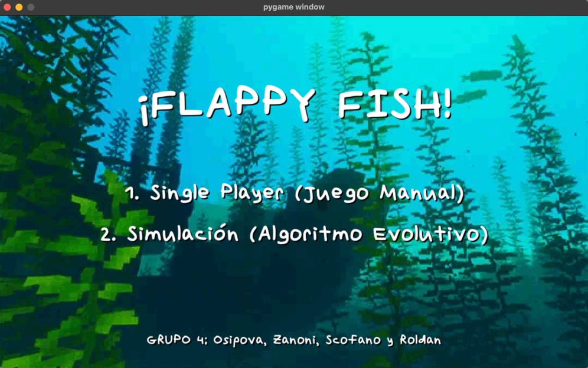

# Flappy Fish — Pygame Game + Genetic Algorithm Agent

A Flappy Bird–inspired game built with Python + Pygame, featuring two operational modes:

- Manual mode (Modo Manual): a classic single-player experience where the user controls the fish.
- Autonomous mode (Modo Automático / Simulación): a population of agents (fish) learns to play on its own using a Genetic Algorithm (GA).

---

### Demo


[Video example (YouTube)](https://www.youtube.com/watch?v=RNBFtw6mRU4)

---

### Project Summary

When the program starts, a main menu is displayed to choose the game mode. The practical assignment is divided into two main parts:

1. Game development: a Flappy Bird–style videogame called Flappy Fish, implemented in Python with Pygame.
2. Intelligent agent training: a Genetic Algorithm that trains a population of fish to play autonomously by evolving their decision parameters over generations.

---

### Objectives

This project goes beyond a basic game implementation, focusing on a dual-mode architecture and algorithmic performance analysis.

- Build a modular dual-mode architecture  
  Integrate two distinct modes (Manual and Simulation) within a single codebase, ensuring a clear separation of responsibilities (game logic vs. algorithmic logic) and full functionality in both modes.

- Optimize agent behavior via evolutionary learning  
  Train a population of agents using simulated evolution mechanisms: selection, crossover, mutation.

- Visualize and analyze fitness evolution  
  Provide visual tools to track learning progress across generations (e.g., fitness trends) and analyze how policy parameters and weights influence performance.

---

### Screenshots (from the poster)

| Menú principal | Modo manual |
|---|---|
|  |  |
| Modo automático | Game over |
|---|---|
|  |  |

---

### Methodology: Dual Operational Design

The implementation was designed to explore and compare two fundamental paradigms:

- Direct manual interaction (user-controlled gameplay).
- Algorithmic automation through a learning approach (GA-driven simulation).

A modular design ensures that both modes can coexist cleanly, with the game loop and environment remaining stable while the control logic changes depending on the selected mode.

---

### Architecture Overview

The project follows a modular, object-oriented architecture to keep responsibilities separated and the codebase maintainable.

Main responsibilities typically include:

- Core game loop / game state
- Fish physics (movement and collisions)
- Visual elements (pipes/obstacles, UI)
- Optional special effects (e.g., screamer/jumpscare module)
- Genetic Algorithm logic and policy evaluation for autonomous play


---

### Genetic Algorithm: Mathematical & Algorithmic Foundation

#### State used by the agent

At each moment, the agent evaluates a state vector based on:

- dy: vertical difference relative to the next pipe gap
- dx: horizontal distance to the next pipe
- vy: current vertical velocity

#### Decision policy

The agent uses a decision policy:

$\gamma : \mathbb{R}^{3} \to \{\text{True}, \text{False}\}$

In practice, the policy is implemented as a weighted combination of normalized state-derived features. A weight vector:

$\mathbf{w} = [w_0, w_1, \dots, w_5]$

parameterizes the behavior. The fish flaps when the policy score crosses a threshold (i.e., when the linear score indicates “jump now”).

> In many implementations, this is expressed as a linear model over an engineered feature vector (often including quadratic terms), which matches the idea of a “quadratic decision policy” while remaining a weighted sum.

#### Fitness & selection (roulette wheel)

Each individual receives a fitness score based on performance (e.g., distance traveled and survival time). Parent selection is done using fitness-proportionate selection (“roulette wheel”), with squared positive fitness to emphasize stronger performers:

$P(i) = \frac{\max(f_i)^2}{\sum_j \max(f_j)^2}$

Intuition:

- Each individual occupies a slice of a roulette wheel.
- Slice size is proportional to fitness.
- Spin the wheel → chosen parent.
- Repeat to produce offspring via crossover and mutation.

[//]: # (![Roulette visualization]&#40;data/readme/CHART.png&#41;)

---

### How to Use

1. Start the program.
2. In the menu, select:
   - Manual to play with keyboard input.
   - Automatic/Simulation to run the GA-trained population.
3. Observe:
   - in manual mode: your score and survival
   - in simulation mode: learning progress across generations (fitness improvements)

---

## Project Setup

Follow these steps to get your project up and running:

### 1. Clone the project

Copy the project from the `main` branch.


### 2. Install requirements

Run the following command to install the necessary dependencies:

```bash
python3 -m pip install -r requirements.txt
```

### 3. Run the project

```bash
cd src
python3 main.py 
```

 
