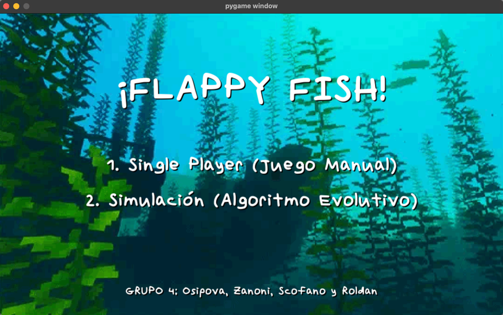
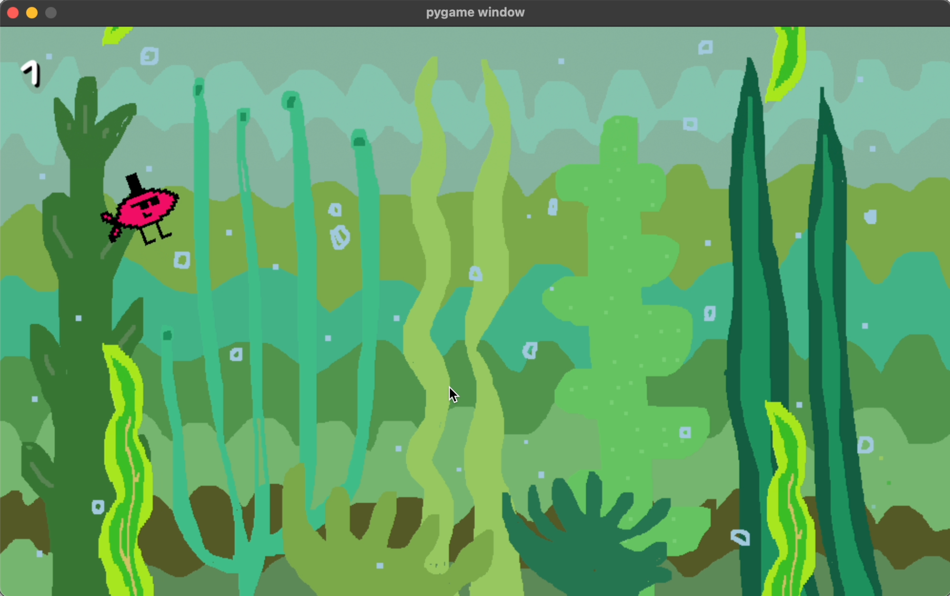
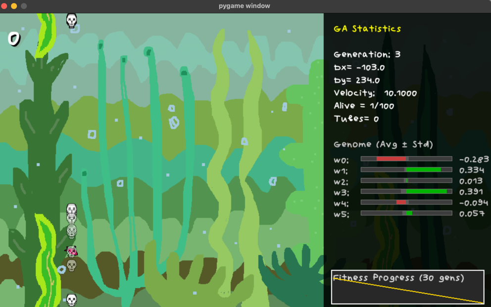
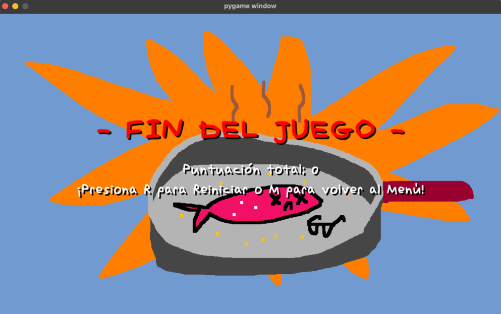

## Flappy Fish — Practical Assignment

## Web app and protected leaderboard

The web game runs on the Node.js server. Ranked scores are replayed by the
server and stored in PostgreSQL; the authenticated Google Apps Script gateway
remains available only as a transitional backend during cutover.
Practice and Evolution do not submit scores. **Ranking is disabled by default**
until the owner configures staging, migrates history and retires old public writers.

See the [PostgreSQL/Northflank runbook](docs/postgres-northflank.md), the
[security reference](docs/security-and-rollout.md), and the transitional
[Apps Script setup](src/google-apps-script/README.md). Tests never modify Google
or deploy the production website; PostgreSQL contract tests use only the
explicit disposable `TEST_DATABASE_URL`.

### GitHub Pages: practice only

Run `npm run build:pages` and publish the generated `dist-pages/` directory.
The static build works below a repository path such as `/flappy-fish/`, includes
the game assets and shared physics, and never calls the ranked API. Manual play
and Evolution remain available, with a visible **practice-only** notice; the
Rank page explains that no results are recorded. Server code, configuration and
secrets are not included. This is separate from the Node.js durable deployment
described above and does not enable or replace its protected leaderboard.


### Objectives

This project goes beyond a basic game implementation, focusing on a dual-mode architecture and algorithmic performance analysis.

- Build a modular dual-mode architecture  
  Integrate two distinct modes (Manual and Simulation) within a single codebase, ensuring a clear separation of responsibilities (game logic vs. algorithmic logic) and full functionality in both modes.

- Optimize agent behavior via evolutionary learning  
  Train a population of agents using simulated evolution mechanisms: selection, crossover, mutation.

- Visualize and analyze fitness evolution  
  Provide visual tools to track learning progress across generations (e.g., fitness trends) and analyze how policy parameters and weights influence performance.


[//]: # (---)

### Screenshots (from the poster)

| Menú principal | Modo manual |
|---|---|
|  |  |
| Modo automático | Game over |
|  |  |

---

### Methodology: Dual Operational Design

The implementation was designed to explore and compare two fundamental paradigms:

- Direct manual interaction (user-controlled gameplay).
- Algorithmic automation through a learning approach (GA-driven simulation).

A modular design ensures that both modes can coexist cleanly, with the game loop and environment remaining stable while the control logic changes depending on the selected mode.

---

### Architecture Overview

The project follows a modular, object-oriented architecture to keep responsibilities separated and the codebase maintainable.

Main responsibilities typically include:

- Core game loop / game state
- Fish physics (movement and collisions)
- Visual elements (pipes/obstacles, UI)
- Optional special effects (e.g., screamer/jumpscare module)
- Genetic Algorithm logic and policy evaluation for autonomous play


---

### Genetic Algorithm: Mathematical & Algorithmic Foundation

#### State used by the agent

At each moment, the agent evaluates a state vector based on:

- dy: vertical difference relative to the next pipe gap
- dx: horizontal distance to the next pipe
- vy: current vertical velocity

#### Decision policy

The agent uses a decision policy:

$\gamma : \mathbb{R}^{3} \to \{\text{True}, \text{False}\}$

In practice, the policy is implemented as a weighted combination of normalized state-derived features. A weight vector:

$\mathbf{w} = [w_0, w_1, \dots, w_5]$

parameterizes the behavior. The fish flaps when the policy score crosses a threshold (i.e., when the linear score indicates “jump now”).

> In many implementations, this is expressed as a linear model over an engineered feature vector (often including quadratic terms), which matches the idea of a “quadratic decision policy” while remaining a weighted sum.

#### Fitness & selection (roulette wheel)

Each individual receives a fitness score based on performance (e.g., distance traveled and survival time). Parent selection is done using fitness-proportionate selection (“roulette wheel”), with squared positive fitness to emphasize stronger performers:

$P(i) = \frac{\max(f_i)^2}{\sum_j \max(f_j)^2}$

Intuition:

- Each individual occupies a slice of a roulette wheel.
- Slice size is proportional to fitness.
- Spin the wheel → chosen parent.
- Repeat to produce offspring via crossover and mutation.

[//]: # (![Roulette visualization]&#40;data/readme/CHART.png&#41;)

---

## Project Setup

Follow these steps to get your project up and running:

### 1. Clone the project

Copy the project from the `main` branch.


### 2. Install web dependencies

Use Node.js22+ and the committed Bun lockfile:

```bash
npm exec --yes --package=bun@1.4.0 -- bun install --frozen-lockfile
npm run build
npm test
```

### 3. Run the project

```bash
npm start
```

Open [the local game](http://localhost:3000). No Google secrets are needed for
practice. For ranked setup, follow the rollout guide above. Browser tests require
OpenSSL and `npx playwright install chromium webkit`, then `npm run test:browser`.

The original Python implementation is preserved in
[legacy-python](legacy-python/README.md).


### 4. Video example

Here is a video to demonstrate how to use the project:

https://www.youtube.com/watch?v=RNBFtw6mRU4


----

### 5. Project page

https://mariia-osipova.github.io/flappy-fish/


 
